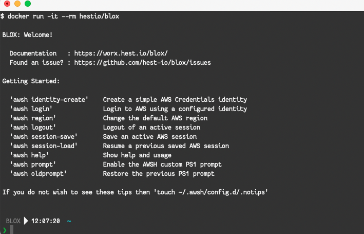

# BLOX: Containerized Tools for developing and building on AWS

[](https://github.com/hest-io/blox/blob/master/LICENSE)
[](http://worx.docs.hest.io/blox/)
[](https://hub.docker.com/r/hestio/blox)

## What is BLOX?



- Containerized Shell with AWS tools inside
  - [Hestio AWSH](http://worx.docs.hest.io/awsh/)
  - [Terraform](https://www.terraform.io/) (multiple versions)
  - [Packer](https://www.packer.io/)
  - [Infracost](https://github.com/infracost/infracost)
  - [Landscape](https://github.com/coinbase/terraform-landscape)
- Developer workspace for Cloud Engineering
- Integrates with Microsoft VS Code (Local, Remote:Container, Remote:WSL, Remote:SSH)
- Compatible with any Operating System that supports Docker (Windows, Linux, MacOS)


## Docker by default

The preferred method of installing and using BLOX is now a Docker container based version that brings you all that you need to run and use BLOX without disrupting your normal OS package setup.

This should make it easier for you to use the latest version and make it easier to rollback an update if a new version breaks something you relied on


## Get and use BLOX

### Basic Usage

- From your command line pull and run the latest BLOX image

    ```console
    $ docker run -it --rm hestio/blox
    ```

### Use BLOX with persistent identities, workspace, proxy config and Active Directory/Kerberos credentials

- Create a path to store your identities

    ```console
    $ mkdir -p ${HOME}/.awsh
    ```

- Run the BLOX container, passing in your AWSH identities and your Kerberos setup and your proxy environment

    ```console
    $ docker run \
        -it \
        --network=host \
        -v ${HOME}/.awsh:/home/blox/.awsh \
        -v /etc/krb5.conf:/etc/krb5.conf \
        -v /etc/krb5.conf.d/:/etc/krb5.conf.d/ \
        -v ${HOME}:/workspace \
        -v /tmp:/tmp \
        -e "http_proxy=${http_proxy}" \
        -e "https_proxy=${https_proxy}" \
        -e "no_proxy=${no_proxy}" \
        -e "KRB5CCNAME=${KRB5CCNAME}" \
        hestio/blox
    ```

### Use BLOX with persistent identities, workspace, proxy config and use a specific Terraform version by default

- Create a path to store your identities

    ```console
    $ mkdir -p ${HOME}/.awsh
    ```

- Run the BLOX container, passing in your AWSH identities and your Kerberos setup and your proxy environment

    ```console
    $ docker run \
        -it \
        --network=host \
        -v ${HOME}/.awsh:/home/blox/.awsh \
        -v /etc/krb5.conf:/etc/krb5.conf \
        -v /etc/krb5.conf.d/:/etc/krb5.conf.d/ \
        -v ${HOME}:/workspace \
        -v /tmp:/tmp \
        -e "http_proxy=${http_proxy}" \
        -e "https_proxy=${https_proxy}" \
        -e "no_proxy=${no_proxy}" \
        -e "KRB5CCNAME=${KRB5CCNAME}" \
        -e "DEFAULT_TERRAFORM_VERSION=0.12.31" \
        hestio/blox
    ```

### Create a wrapper script to allow BLOX to be used as a Shell

- Create the wrapper script `/usr/local/bin/blox`

    ```bash
    #!/bin/bash

    PUID=$(id -u)
    PGID=$(id -g)

    [ -d ${HOME}/.awsh ] || mkdir -p ${HOME}/.awsh

    docker run \
        -it \
        --rm \
        --network=host \
        --user ${PUID}:${PGID} \
        -v ${HOME}/.awsh:/home/blox/.awsh \
        -v /etc/krb5.conf:/etc/krb5.conf \
        -v /etc/krb5.conf.d/:/etc/krb5.conf.d/ \
        -v ${HOME}/workspace:/home/blox/workspace \
        -v /tmp:/tmp \
        -e "HOME=/home/blox" \
        -e "PUID=${PUID}" \
        -e "PGID=${PGID}" \
        -e "http_proxy=${http_proxy}" \
        -e "https_proxy=${https_proxy}" \
        -e "no_proxy=${no_proxy}" \
        -e "KRB5CCNAME=${KRB5CCNAME}" \
        hestio/blox
    ```

- Make the wrapper executable

    ```console
    sudo chmod a+x /usr/local/bin/blox
    ```

- Start the wrapper script normally

    ```console
    blox
    ```
